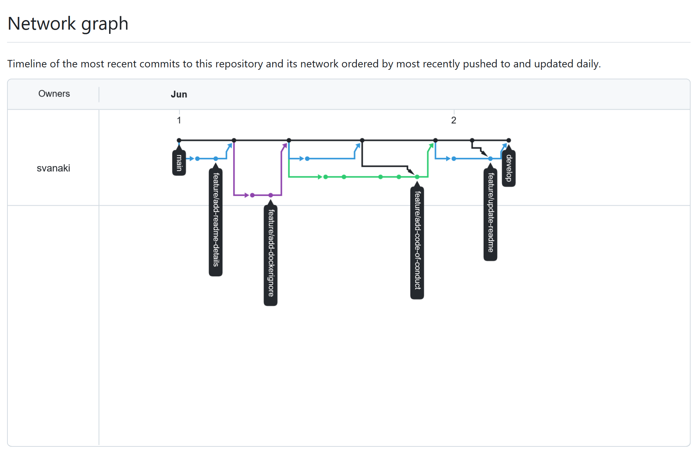
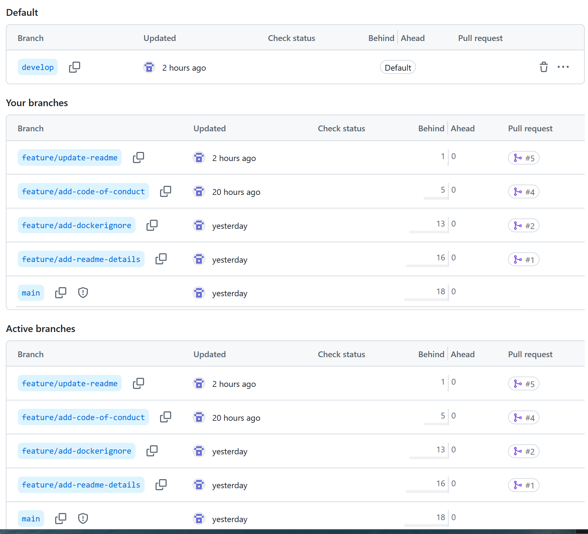
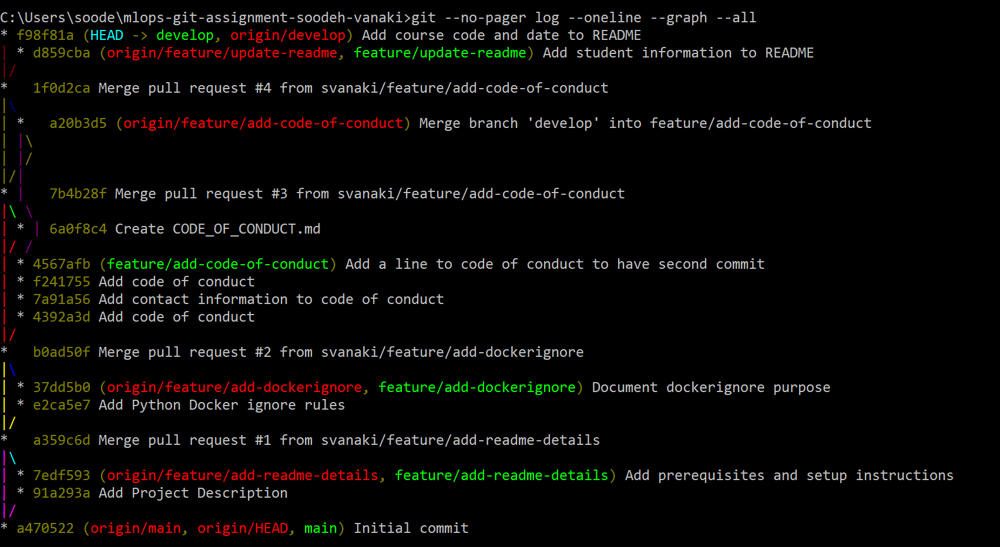
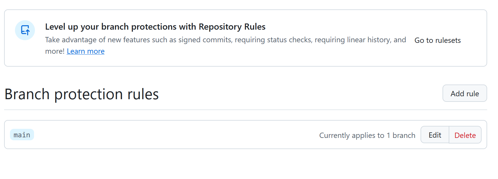
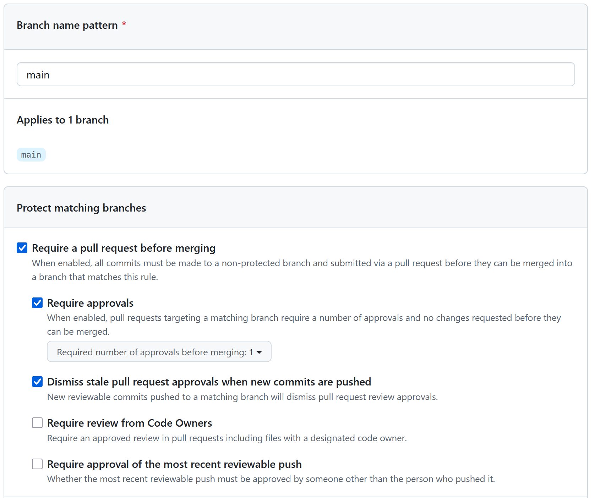
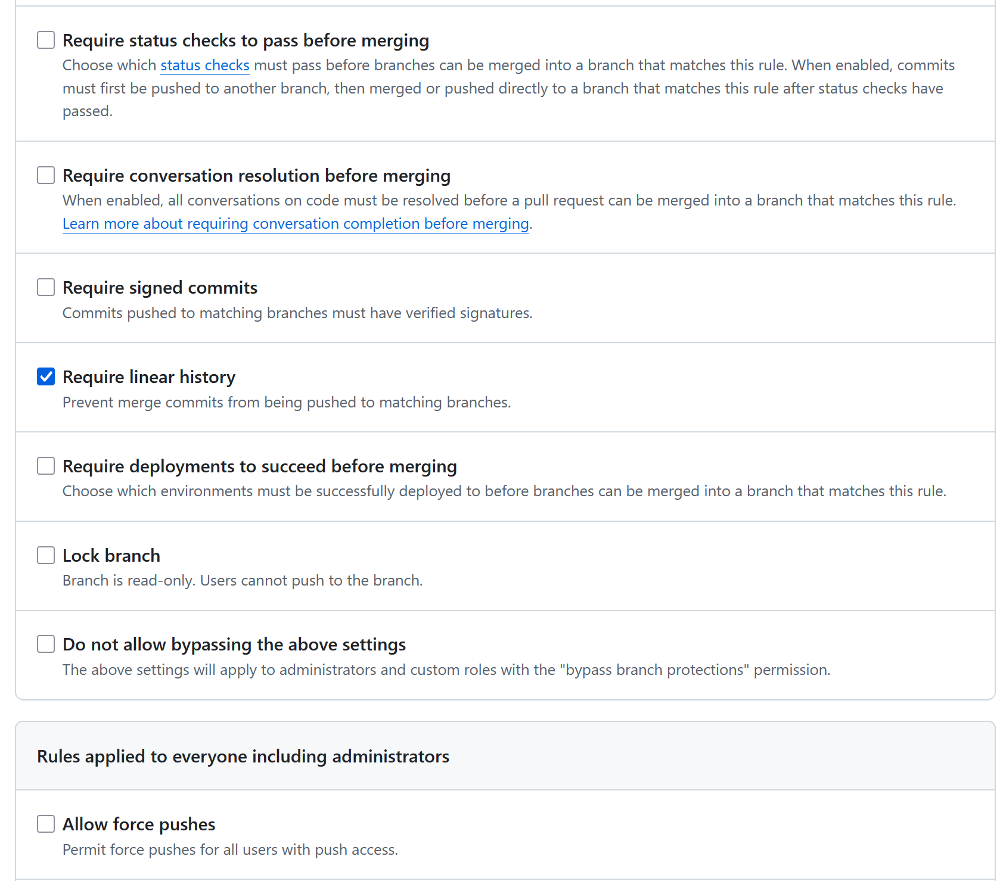
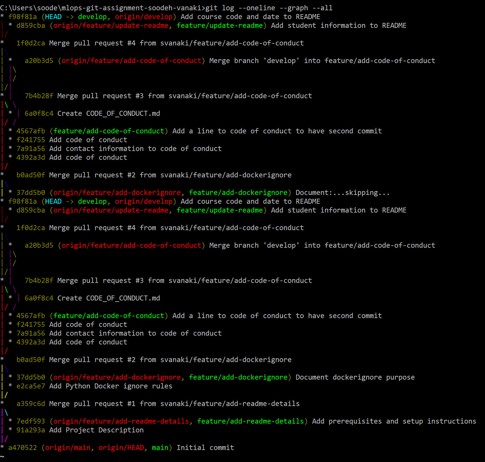

# Assignment 1 Report

## Reflection

The most challenging part of this assignment was resolving the merge conflict because Git showed two different
changes in the README file. I had to carefully compare both versions and make sure I kept both the student
information and the course information. This helped me understand why teams use pull requests and branch reviews
before merging code.

## GitHub Repository

https://github.com/svanaki/mlops-git-assignment-soodeh-vanaki

## Network Graph Screenshot

## Branches

## Branches Log

## Branch Protection Screenshot

## Git Log Output

